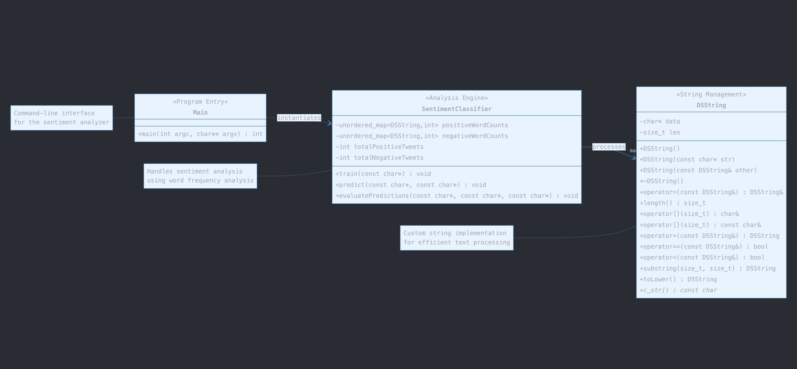

# Assignment 2: Answers

**Complete this document, commit your changes to Github and submit the repository URL to Canvas.** Keep your answers short and precise.

Name: Manuel Garcia
Contributors: Neel Patel, Inzwi Zunga, Muiz Ishola

Bonus: Accuracy and Improvements. Initial accuracy 61.3%
after using stop words we increased it to 63.45

## UML Diagram

Add your UML class diagram here.

## Answers

1. How do you train the model and how do you classify a new tweet? Give a short description of the main steps.

To train the model, we read the training dataset and preprocessed each tweet by tokenizing it into words, converting 
them to lowercase, removing stop words, and handling negations if implemented. We then updated word counts in positive 
and negative hash maps based on the sentiment label of each tweet. For classification, we applied the same preprocessing 
to new tweets, calculated positive and negative scores by summing the counts of each word from the trained hash maps, 
and assigning the sentiment that has the higher score.

2. How long did your code take for training and what is the time complexity of your training implementation (Big-Oh notation)?

The training code took 0.742s to run. The time complexity is O(N x L), where N is the number of tweets and L is the 
length of a tweet. Each tweet is processed individually then tokenization operates over its length. Updating word counts 
in std::unordered_map takes average constant time, so the overall complexity depends on the total number of tweets and 
their lengths.

3. How long did your code take for classification and what is the time complexity of your classification implementation (Big-Oh notation)?

Classification took about 0.3996s. The time complexity is O(M x L'), where M is the number of tweets to classify and L' 
is the tweet length. Each tweet is preprocessing and scoring, with word lookups in hash maps taking constant time. 
Therefore, the complexity scales linearly with the number of tweets and their lengths.

4. What accuracy did your algorithm achieve on the provides training and test data?

Accuracy: 63.4%

5. What were the changes that you made that improved the accuracy the most?

Stop word removal improved accuracy the most. By eliminating common words that do not contribute significant meaning, 
the model focused on more impactful words, reducing noise and enhancing its ability to correctly classify sentiments.

6. How do you know that you use proper memory management? I.e., how do you know that you do not have a memory leak?

We ensured proper memory management by implementing the Rule of Three in the DSString class, correctly handling dynamic 
memory in the destructor, copy constructor, and copy assignment operator. Using standard containers like std::vector 
and std::unordered_map also helped manage memory automatically. We verified there were no memory leaks by testing the 
program with Valgrind on Linux.

7. What was the most challenging part of the assignment?

The most challenging part was handling CSV parsing and data preprocessing, especially dealing with tweets containing 
commas and special characters. Implementing a strong parser without advanced libraries and ensuring accurate data 
extraction was difficult.